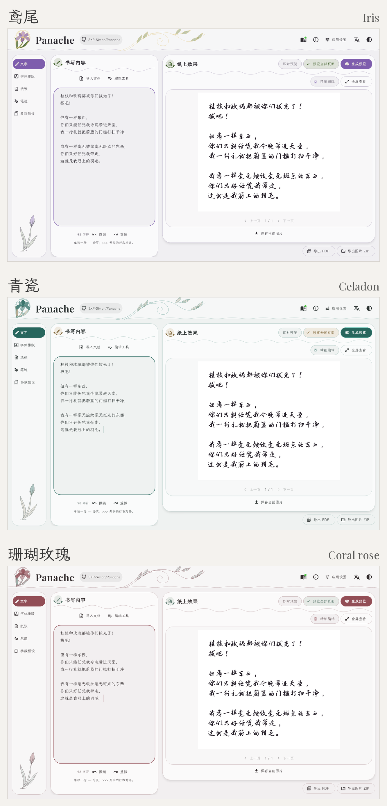
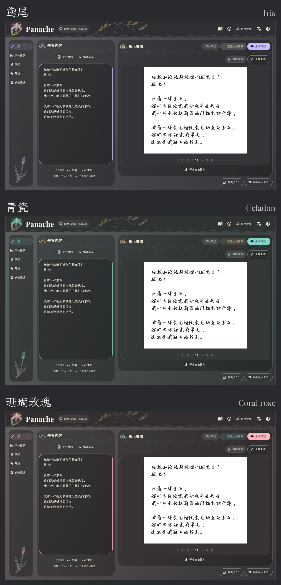

# Panache

[简体中文](README.zh-CN.md)

| Light | Dark |
| --- | --- |
|  |  |

## Demo video

[▶ Watch the Panache demo (48 seconds, in Chinese)](https://heliannuits.me/Panache/assets/panache-promo-fe580853fbfa23.mp4)

## The workbench

Panache turns text, equations, tables, and circuit diagrams into handwritten pages. Import a document, choose a handwriting font, and lay it out on a paper template or a photo of your own stationery. Export a single page as PNG or the whole document as a PDF or ZIP of images.

Import TXT, DOCX, PDF, or RTF, or paste text directly. Preview the document, then select handwriting to move it, adjust the ink, or align it with the lines on the paper.

[Download Panache](https://github.com/SXP-Simon/Panache/releases/latest) · [Write your first page](https://heliannuits.me/Panache/en/guide/getting-started/) · [Self-host the web app](https://heliannuits.me/Panache/en/self-hosting/docker/)

Offline downloads are available for Windows x64, macOS on Apple silicon, Linux x64, and Android (arm64-v8a and x86_64). The iOS client currently requires a source build.

## Contributing

Report bugs in [GitHub Issues](https://github.com/SXP-Simon/Panache/issues). For local setup, tests, and pull requests, see [CONTRIBUTING.md](CONTRIBUTING.md).

## License

[AGPL-3.0-only](LICENSE)

## Acknowledgments

- Thanks to [14790897/handwriting-web](https://github.com/14790897/handwriting-web) for the original project that inspired Panache.
- Thanks to [AnxForever’s StyleKit](https://github.com/AnxForever/stylekit) for the [Art Nouveau guide](https://www.stylekit.top/zh/styles/art-nouveau) that inspired the workbench’s floral motifs and curves.
- Thanks to [HakimYu](https://github.com/HakimYu) for the Flutter and Rust migration, and to everyone who has [contributed to Panache](https://github.com/SXP-Simon/Panache/graphs/contributors).
